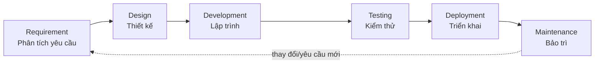
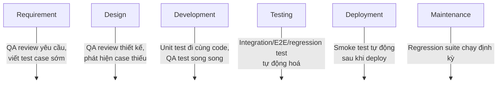

# Chương 1: SDLC là gì? Vị trí của kiểm thử trong vòng đời phát triển phần mềm

## Mục tiêu học

- Gọi tên và giải thích được 6 giai đoạn cơ bản của SDLC.
- Phân biệt cách testing được lồng vào SDLC ở mô hình Waterfall so với Agile/DevOps.
- Giải thích được nguyên lý "Cost of Defect" — vì sao phát hiện lỗi càng trễ càng tốn kém.
- Áp dụng được tư duy "shift-left testing" vào một tính năng cụ thể.

> Ví dụ mẫu: `code/ch01-sdlc/test-case-list-login.md` — một bộ test case hoàn chỉnh cho tính năng đăng nhập, viết ra *trước khi* code được viết (đúng tinh thần shift-left ở mục 1.3). Đọc song song với mục 1.4 để thấy rõ QA tham gia sớm như thế nào trong thực tế.

## 1.1. Vì sao lập trình viên cần hiểu SDLC?

Nếu bạn đã biết lập trình, bạn quen với việc viết code, chạy thử, commit, và push. Nhưng viết một tính năng chạy được chỉ là một mắt xích nhỏ trong một quy trình lớn hơn nhiều — quy trình đó được gọi là **SDLC (Software Development Life Cycle — Vòng đời phát triển phần mềm)**.

Hiểu SDLC quan trọng với người làm automation test vì một lý do đơn giản: **test không phải là một bước làm sau cùng**, mà là một hoạt động cần được lồng vào *mọi* giai đoạn của SDLC. Nếu không biết SDLC vận hành ra sao, bạn sẽ không biết nên viết test gì, viết lúc nào, và test đó phục vụ mục đích gì trong bức tranh chung.

## 1.2. SDLC là gì?

**SDLC** là tập hợp các giai đoạn (phases) mà một đội phát triển phần mềm đi qua để biến một ý tưởng/yêu cầu thành sản phẩm hoạt động, được vận hành, và được bảo trì:



Đây là mô hình khái niệm chung. Trên thực tế, thứ tự và cách các giai đoạn này lặp lại phụ thuộc vào **mô hình phát triển (SDLC model)** mà đội ngũ áp dụng.

### Các mô hình SDLC phổ biến

| Mô hình | Đặc điểm | Testing diễn ra khi nào |
|---|---|---|
| **Waterfall** | Các giai đoạn tuần tự, giai đoạn sau chỉ bắt đầu khi giai đoạn trước hoàn tất | Chỉ ở cuối, sau khi code xong toàn bộ — phát hiện lỗi rất trễ |
| **Agile / Scrum** | Chia nhỏ thành các **sprint** (thường 1–2 tuần), mỗi sprint đều có đủ analysis → design → dev → test | Testing diễn ra **trong từng sprint**, song song với development |
| **DevOps / CI-CD** | Tích hợp và triển khai liên tục, tự động hoá tối đa | Testing (đặc biệt automation test) chạy **liên tục**, tự động, mỗi khi có code mới |

Phần lớn các công ty hiện nay dùng Agile kết hợp DevOps — đây cũng là bối cảnh mà automation testing (chủ đề chính của sách này) phát huy giá trị lớn nhất, vì test cần chạy nhanh và lặp lại liên tục.

## 1.3. Vị trí của Testing trong SDLC

### Trong mô hình Waterfall truyền thống

Testing là một giai đoạn **riêng biệt, nằm cuối**:

```
Requirement → Design → Development → [Testing] → Deployment → Maintenance
```

Vấn đề: nếu một lỗi đến từ việc hiểu sai yêu cầu ở bước 1, thì phải đến tận bước 4 nó mới bị phát hiện — lúc đó, sửa lỗi rất tốn kém vì code đã được xây dựng dựa trên hiểu sai đó.

### Trong Agile/DevOps hiện đại: Shift-Left Testing

Tư duy hiện đại gọi là **"shift-left"** — dịch hoạt động testing về *sớm hơn* trong vòng đời, thay vì dồn hết vào cuối:



Testing không còn là một "cổng chặn" ở cuối, mà là hoạt động **xuyên suốt**.

### Vì sao phát hiện lỗi càng trễ càng tốn kém?

Đây là nguyên lý kinh điển trong QA, thường gọi là **"Cost of Defect"**: chi phí sửa một lỗi tăng theo cấp số nhân tuỳ vào giai đoạn nó bị phát hiện.

| Giai đoạn phát hiện lỗi | Chi phí sửa (tương đối) |
|---|---|
| Lúc phân tích yêu cầu | 1x |
| Lúc thiết kế | ~5x |
| Lúc lập trình | ~10x |
| Lúc testing | ~15–40x |
| Sau khi đã lên production | ~30–100x |

Đây chính là lý do automation test — vốn có thể chạy lại nhanh, thường xuyên, ngay khi có code mới — trở thành công cụ quan trọng để phát hiện lỗi sớm nhất có thể, thay vì đợi đến cuối sprint hay cuối release.

## 1.4. Ví dụ minh hoạ: tính năng "Đăng nhập" đi qua SDLC

Giả sử team đang xây một tính năng đăng nhập cho web app. Vai trò QA xuất hiện ở từng bước như sau:

1. **Requirement:** QA đọc yêu cầu "Người dùng đăng nhập bằng email + password". QA đặt câu hỏi: Nếu sai password 5 lần thì sao? Có giới hạn độ dài password không? → giúp làm rõ yêu cầu *trước khi* code được viết.
2. **Design:** QA xem thiết kế API `/login`, thiết kế UI form đăng nhập, phát hiện thiếu case "email không tồn tại" trong flow.
3. **Development:** Dev viết unit test cho hàm validate email. QA chuẩn bị sẵn bộ test case (xem `code/ch01-sdlc/test-case-list-login.md`) song song với lúc dev code.
4. **Testing:** QA (hoặc automation test bằng Playwright — nội dung chính từ Phần IV trở đi) chạy các kịch bản trong bộ test case đó: đăng nhập đúng, đăng nhập sai password, để trống field, v.v.
5. **Deployment:** Một smoke test tự động (ví dụ 1 test Playwright đơn giản: "đăng nhập thành công với tài khoản demo") chạy ngay sau khi deploy để đảm bảo tính năng không bị vỡ trên production.
6. **Maintenance:** Vài tuần sau, team sửa lại UI trang login. Bộ regression test tự động (đã viết bằng Playwright) chạy lại toàn bộ để đảm bảo không có gì bị hỏng do thay đổi này.

Ở bước 4 và 6, chính là nơi automation testing — chủ đề toàn bộ cuốn sách này — đóng vai trò lớn nhất.

**Xem ví dụ chi tiết:** `code/ch01-sdlc/test-case-list-login.md` là bộ test case thật, viết theo đúng format một QA sẽ dùng trong công việc (ID, tiền điều kiện, các bước, kết quả mong đợi) — đây chính là "sản phẩm đầu ra" của bước Requirement/Development ở trên, và là input trực tiếp để viết automation test bằng Playwright sau này (Phần IV).

## Bài tập

1. Chọn một tính năng bất kỳ mà bạn từng code (ví dụ: form đăng ký, giỏ hàng, tìm kiếm...).
2. Liệt kê 6 giai đoạn SDLC (Requirement → Maintenance) áp dụng cho tính năng đó.
3. Với mỗi giai đoạn, viết ra: "Nếu có QA tham gia ở đây, họ sẽ làm gì và có thể phát hiện lỗi gì?"
4. Tham khảo format ở `code/ch01-sdlc/test-case-list-login.md`, tự viết một bộ test case tương tự (tối thiểu 5 test case) cho tính năng bạn đã chọn.
5. Đánh dấu giai đoạn nào theo bạn là **quá trễ** để phát hiện lỗi nếu chỉ test ở đó — so sánh với nguyên lý "Cost of Defect" ở mục 1.3.

## Lỗi thường gặp

- **Coi testing là việc "của QA" xảy ra sau khi dev code xong**: đây chính là tư duy Waterfall lỗi thời. Trong Agile/DevOps, QA tham gia từ bước Requirement, không đợi đến khi có build để test.
- **Không viết test case trước, chỉ "test tay theo cảm tính"**: dẫn đến bỏ sót case (ví dụ quên test "để trống field", "sai định dạng email"). Luôn có một danh sách test case tường minh, dù ngắn, trước khi bắt đầu test — kể cả automation test.
- **Chỉ chạy test một lần lúc release, không chạy lại (regression) sau mỗi thay đổi**: đây là lý do chính khiến automation test trở nên cần thiết — chạy tay lại toàn bộ test case sau mỗi thay đổi nhỏ là không khả thi về thời gian.

## Tóm tắt & tiếp theo

- SDLC là vòng đời phát triển phần mềm gồm các giai đoạn: Requirement, Design, Development, Testing, Deployment, Maintenance.
- Có nhiều mô hình SDLC (Waterfall, Agile, DevOps); cách testing được lồng vào khác nhau ở mỗi mô hình.
- Xu hướng hiện đại là **shift-left testing**: đưa testing vào càng sớm càng tốt, xuyên suốt vòng đời thay vì chỉ ở cuối.
- Lỗi phát hiện càng trễ, chi phí sửa càng cao — đây là động lực chính cho automation testing.

Chương 2 sẽ đi sâu vào các **loại kiểm thử** (Manual vs Automation, Unit/Integration/E2E/Regression) — nền tảng để hiểu automation test (bằng Playwright) nên thay thế và bổ sung cho manual test ở những điểm nào.
