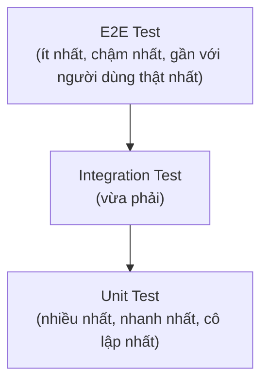

# Chương 2: Các loại kiểm thử — Manual vs Automation, Unit / Integration / E2E / Regression

## Mục tiêu học

- Phân biệt Manual testing và Automation testing, biết khi nào loại nào phù hợp hơn.
- Giải thích được "Testing Pyramid" và vị trí của Unit / Integration / E2E test trong đó.
- Viết được ví dụ cụ thể phân biệt Unit test và Integration test bằng code thật.
- Hiểu Regression test là gì và vì sao nó gắn liền chặt chẽ với automation test.

> Code mẫu: `code/ch02-loai-kiem-thu/` — một module tính tiền giỏ hàng nhỏ, có cả unit test và
> integration test chạy được bằng `node`, không cần cài gì thêm.

## 2.1. Manual Testing vs Automation Testing

**Manual testing**: con người trực tiếp thao tác trên ứng dụng (click, nhập liệu, quan sát) để
kiểm tra kết quả có đúng như mong đợi không — không có code nào "tự chạy" test.

**Automation testing**: viết code để tự động thực hiện lại các bước thao tác và tự động so sánh
kết quả — như các test Playwright mà sách này sẽ dạy từ Phần IV.

| Tiêu chí | Manual Testing | Automation Testing |
|---|---|---|
| Tốc độ chạy lại (regression) | Chậm, tốn nhân lực mỗi lần | Nhanh, chạy lại bao nhiêu lần cũng được với chi phí gần như 0 |
| Chi phí ban đầu | Thấp (không cần viết code) | Cao hơn (cần thời gian viết & bảo trì test) |
| Phù hợp với | Exploratory testing, UI/UX review, test một lần, case phức tạp/hiếm | Test lặp lại nhiều lần (regression), test chạy trong CI/CD |
| Độ tin cậy khi lặp lại | Phụ thuộc con người, dễ bỏ sót bước | Nhất quán tuyệt đối — chạy đúng y hệt mỗi lần |
| Phát hiện lỗi UI/UX tinh tế | Tốt (con người "cảm" được cái gì "trông sai") | Kém hơn, trừ khi có visual testing chuyên biệt (Chương 21) |

**Quan trọng:** Automation testing không thay thế hoàn toàn Manual testing. Automation giỏi ở việc
lặp lại chính xác một kịch bản đã biết trước (regression); Manual/Exploratory testing giỏi ở việc
tìm ra những lỗi *chưa ai nghĩ tới*. Một đội QA trưởng thành dùng cả hai, không chọn một bỏ một.

## 2.2. Testing Pyramid: Unit → Integration → E2E



**Testing Pyramid** là mô hình khuyến nghị về *tỉ lệ* giữa các cấp độ test: viết **nhiều** unit
test (nhanh, rẻ, chạy trong mili-giây), **vừa phải** integration test, và **ít** E2E test (chậm,
đắt, nhưng gần nhất với trải nghiệm người dùng thật). Lý do: một test E2E chạy qua cả trình duyệt
thật có thể mất vài giây, trong khi một unit test chạy trong vài mili-giây — nếu suite test của
bạn toàn E2E, chạy hàng nghìn test sẽ mất hàng giờ.

### Unit test

Kiểm thử **một đơn vị nhỏ nhất có thể** (thường là một hàm/function), **cô lập hoàn toàn** khỏi
phần còn lại của hệ thống — không gọi database thật, không gọi API thật, không cần trình duyệt.

```js
// cart.js — hàm cần test
function applyDiscount(subtotal, discountPercent) {
  return subtotal - (subtotal * discountPercent) / 100;
}

// unit test: chỉ gọi MỘT hàm này, không liên quan gì tới hàm khác
assert.strictEqual(applyDiscount(200000, 10), 180000);
```

### Integration test

Kiểm thử **nhiều đơn vị phối hợp với nhau** — ví dụ hàm A gọi hàm B, hoặc code gọi vào một
database/API thật (hay bản giả lập gần giống thật). Mục đích: bắt các lỗi chỉ xuất hiện khi các
phần *ghép lại*, dù từng phần riêng lẻ đều đúng.

```js
// calculateTotal() bên trong gọi cả calculateSubtotal + applyDiscount + formatCurrencyVND
// integration test xác minh cả 3 hàm này ăn khớp khi phối hợp
assert.strictEqual(calculateTotal(items, 10), "360.000 đ");
```

→ Chạy thử cả hai loại test này với code thật ở `code/ch02-loai-kiem-thu/` (xem README trong đó
để thấy ví dụ cụ thể một lỗi mà unit test **không** bắt được nhưng integration test bắt được).

### E2E test (End-to-End)

Kiểm thử **toàn bộ luồng người dùng thật**, từ đầu đến cuối, thường qua giao diện thật (trình
duyệt thật đối với web app) — gần nhất với trải nghiệm người dùng, nhưng cũng chậm nhất và dễ vỡ
nhất (flaky) nếu viết không cẩn thận.

```ts
// Playwright E2E test — cú pháp thật, sẽ học chi tiết từ Chương 11.
// Đây là một luồng thật: mở trình duyệt, điền form, bấm nút, kiểm tra kết quả.
await page.goto("/login");
await page.getByLabel("Email").fill("demo@example.com");
await page.getByLabel("Mật khẩu").fill("Password123!");
await page.getByRole("button", { name: "Đăng nhập" }).click();
await expect(page).toHaveURL("/dashboard");
```

Đây chính xác là TC-01 trong bộ test case ở Chương 1 (`code/ch01-sdlc/test-case-list-login.md`) —
được hiện thực hoá thành automation test thật. Toàn bộ Phần IV của sách này tập trung vào việc viết
loại test này bằng Playwright.

## 2.3. Regression Test

**Regression testing** là việc chạy lại các test đã có (thường là một tập hợp lớn, gọi là
**regression suite**) sau mỗi lần code thay đổi, để đảm bảo thay đổi mới **không làm hỏng** những
gì đã hoạt động đúng trước đó.

Regression test không phải là một *loại* test riêng theo kiểu Unit/Integration/E2E — mà là một
**mục đích sử dụng**: bất kỳ test nào (unit, integration, hay E2E) đều có thể là một phần của
regression suite, miễn là nó được chạy lại lặp đi lặp lại.

Đây là điểm mà automation testing trở nên gần như bắt buộc: chạy tay lại 200 test case sau mỗi lần
sửa code là không khả thi. Một regression suite tự động (chạy trong CI/CD — xem Chương 19) có thể
chạy lại toàn bộ trong vài phút, mỗi khi có commit mới.

## Bài tập

1. Chạy `node unit-test.js` và `node integration-test.js` trong `code/ch02-loai-kiem-thu/`, xác
   nhận cả hai đều pass.
2. Làm theo hướng dẫn "Vì sao có cả hai vẫn cần thiết?" trong README của code mẫu — cố tình gây
   lỗi trong `cart.js` và quan sát unit test lẫn integration test phản ứng khác nhau ra sao.
3. Với tính năng bạn đã chọn ở bài tập Chương 1, liệt kê: test nào nên là unit test, test nào nên
   là integration test, test nào bắt buộc phải là E2E (vì cần cả UI thật)?
4. Ước tính: nếu team bạn có 300 test case, chạy tay mất trung bình 3 phút/case, một lần regression
   đầy đủ mất bao lâu? So sánh với thời gian một suite automation tương đương có thể chạy song song.

## Lỗi thường gặp

- **Viết toàn E2E test, không có unit/integration test**: suite chạy rất chậm, khó xác định chính
  xác lỗi nằm ở đâu khi test fail (vì E2E test chạm vào rất nhiều thứ cùng lúc).
- **Nhầm lẫn "test nhiều" với "test tốt"**: 100% coverage bằng unit test không đảm bảo hệ thống
  chạy đúng nếu không có integration/E2E test nào xác minh các phần ghép lại đúng.
- **Bỏ qua regression testing vì "tính năng cũ chắc vẫn chạy tốt"**: đây là nguyên nhân phổ biến
  nhất của bug production — một thay đổi tưởng chừng không liên quan làm hỏng tính năng khác.

## Tóm tắt & tiếp theo

- Manual và Automation testing bổ trợ cho nhau, không thay thế hoàn toàn nhau.
- Testing Pyramid khuyến nghị: nhiều unit test, vừa phải integration test, ít E2E test.
- Regression testing là lý do chính khiến automation testing trở nên cần thiết trong Agile/DevOps.

Chương 3 sẽ đi vào các khái niệm nền tảng mà mọi QA cần thành thạo trước khi viết test đầu tiên:
test case, test plan, và bug report.
