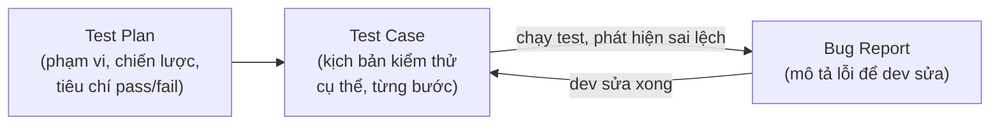

# Chương 3: Test case, test plan, bug report — những khái niệm cơ bản mọi QA cần biết

## Mục tiêu học

- Viết được một test case đầy đủ, rõ ràng, người khác đọc vào làm theo được ngay.
- Biết một test plan gồm những phần nào và dùng để làm gì.
- Viết được một bug report đủ thông tin để dev tái hiện và sửa lỗi mà không cần hỏi lại.
- Hiểu mối quan hệ giữa 3 tài liệu này trong quy trình QA thực tế.

> Ví dụ: `code/ch03-test-case-plan-bug/` — test plan và bug report thật, viết cho cùng tính năng
> đăng nhập đã dùng ở Chương 1–2, để thấy rõ 3 tài liệu (test plan → test case → bug report) khớp
> với nhau như thế nào trong một luồng làm việc thực tế.

## 3.1. Mối quan hệ giữa Test Plan, Test Case, và Bug Report

- **Test Plan** trả lời câu hỏi "chúng ta sẽ test cái gì, test như thế nào, và khi nào coi là đủ?"
  — viết **một lần** cho cả tính năng/release.
- **Test Case** là **từng kịch bản cụ thể** để thực thi việc test đó — một test plan sinh ra nhiều
  test case (xem `code/ch01-sdlc/test-case-list-login.md`: 10 test case cho 1 test plan).
- **Bug Report** được viết ra **khi một test case fail** — ghi lại đủ thông tin để dev tái hiện và
  sửa lỗi.

## 3.2. Test Case — giải phẫu một test case tốt

Một test case tốt có các thành phần sau (đã áp dụng ở Chương 1):

| Thành phần | Vai trò | Ví dụ |
|---|---|---|
| **ID** | Định danh duy nhất, để trace ngược khi có bug | `TC-01` |
| **Tiêu đề** | Mô tả ngắn gọn mục đích của test | "Đăng nhập thành công với tài khoản hợp lệ" |
| **Tiền điều kiện (Precondition)** | Trạng thái hệ thống phải có *trước khi* thực hiện test | "Ở trang `/login`" |
| **Các bước (Steps)** | Thao tác cụ thể, theo đúng thứ tự, đủ rõ để người khác làm theo | "1. Nhập email...\n2. Bấm..." |
| **Dữ liệu vào (Test Data)** | Giá trị cụ thể dùng để test — không viết chung chung | `email: demo@example.com` |
| **Kết quả mong đợi (Expected Result)** | Kết quả **chính xác, đo lường được** — không viết mơ hồ | "Chuyển sang `/dashboard`" (không viết "hoạt động đúng") |

**Nguyên tắc quan trọng nhất:** kết quả mong đợi phải đủ cụ thể để hai người khác nhau đọc vào và
đưa ra cùng một kết luận Pass/Fail. So sánh:

- ❌ Mơ hồ: "Đăng nhập hoạt động tốt."
- ✅ Cụ thể: "Chuyển sang trang `/dashboard`, hiển thị tên người dùng ở góc phải."

Đây cũng chính là nền tảng để viết automation test sau này — một `expect()` trong Playwright
(Chương 11) *chính là* một "kết quả mong đợi" được viết thành code, nên nếu test case mơ hồ, bạn
sẽ không biết viết `expect()` gì.

## 3.3. Test Plan — bức tranh lớn hơn một test case

Một test case chỉ nói về *một kịch bản*. Test plan trả lời những câu hỏi rộng hơn, ở cấp độ cả
tính năng hoặc cả release — xem ví dụ đầy đủ ở `code/ch03-test-case-plan-bug/test-plan-login.md`,
gồm các phần chính:

1. **Mục tiêu** — vì sao cần test cái này.
2. **Phạm vi (Scope)** — cái gì *nằm trong* và *nằm ngoài* phạm vi test lần này. Đây là phần hay
   bị bỏ qua nhất nhưng quan trọng nhất: không ghi rõ "ngoài phạm vi", QA dễ tốn thời gian test
   những thứ không ai yêu cầu, hoặc bị hỏi "sao không test cái X" khi X chưa từng được thống nhất
   nằm trong phạm vi.
3. **Chiến lược kiểm thử** — cấp độ nào (unit/integration/E2E — xem Chương 2) do ai làm, bằng công
   cụ gì.
4. **Môi trường kiểm thử** — test ở đâu, dữ liệu test nào, trình duyệt nào.
5. **Tiêu chí Pass/Fail (Entry/Exit Criteria)** — điều kiện để *bắt đầu* test, và điều kiện để coi
   là *test xong, đủ điều kiện release*.
6. **Rủi ro** — những gì có thể cản trở việc test (ví dụ: một case khó test tự động vì phụ thuộc
   thời gian thực — xem mục Rủi ro trong ví dụ).
7. **Lịch trình** — mốc thời gian cho từng giai đoạn test.

## 3.4. Bug Report — viết sao để dev không cần hỏi lại

Một bug report thiếu thông tin khiến dev phải hỏi lại QA nhiều lần ("làm sao để tái hiện?", "test
trên môi trường nào?"), làm chậm cả quá trình. Xem ví dụ đầy đủ ở
`code/ch03-test-case-plan-bug/bug-report-example.md` — lưu ý các phần bắt buộc:

- **Steps to Reproduce** — các bước *chính xác*, đủ chi tiết để dev tự tái hiện được lỗi trên máy
  của họ, không bỏ sót bước nào.
- **Expected Result** vs **Actual Result** — viết tách biệt rõ ràng, không gộp chung.
- **Severity** (mức độ nghiêm trọng về mặt kỹ thuật/nghiệp vụ) khác với **Priority** (mức độ ưu
  tiên sửa) — một bug có thể Severity thấp (lỗi chính tả) nhưng Priority cao (xuất hiện ngay trang
  chủ, ảnh hưởng thương hiệu), hoặc ngược lại.
- **Log/Screenshot** — bằng chứng khách quan, không chỉ mô tả bằng lời.
- **Môi trường** — trình duyệt, build number, dữ liệu test cụ thể đã dùng — thiếu phần này là
  nguyên nhân phổ biến nhất khiến dev không tái hiện được lỗi ("trên máy tôi vẫn chạy bình
  thường").

**Liên hệ với automation test:** khi bug này được dev sửa xong, TC-07 sẽ được tự động hoá bằng
Playwright (Chương 22, phần seed dữ liệu tài khoản đã sai N lần) và chạy lại mỗi lần có commit mới
— để bug BUG-142 **không bao giờ tái xuất hiện mà không ai biết** (đây chính là quy trình
regression testing đã học ở Chương 2).

## Bài tập

1. Đọc `code/ch03-test-case-plan-bug/bug-report-example.md`. Giả sử bạn là dev, chỉ dựa vào bug
   report đó (không hỏi lại QA), bạn có tái hiện được lỗi không? Còn thiếu thông tin gì không?
2. Viết một bug report tương tự cho một lỗi bạn từng gặp (trong dự án cá nhân hoặc công việc),
   đảm bảo đủ 7 phần như ví dụ.
3. Với tính năng bạn chọn từ Chương 1, viết một test plan ngắn gọn (không cần đủ 7 phần, chỉ cần
   Mục tiêu + Phạm vi + Tiêu chí Pass/Fail).
4. Chọn 2 test case bất kỳ trong `code/ch01-sdlc/test-case-list-login.md`, đánh giá xem "Kết quả
   mong đợi" của chúng đã đủ cụ thể (đo lường được) chưa — nếu chưa, viết lại cho rõ hơn.

## Lỗi thường gặp

- **Viết "Kết quả mong đợi" mơ hồ** (ví dụ "hoạt động đúng", "hiển thị hợp lý"): không thể quyết
  định Pass/Fail một cách khách quan, mỗi người đọc hiểu một kiểu.
- **Bug report thiếu bước tái hiện chi tiết**: khiến dev không tái hiện được, phải hỏi lại nhiều
  lần, làm chậm chu kỳ sửa lỗi — đối lập trực tiếp với tinh thần "shift-left" đã học ở Chương 1.
- **Không ghi rõ "ngoài phạm vi" trong test plan**: dẫn đến tranh cãi "tại sao không test cái này"
  sau khi đã release, dù chưa từng ai yêu cầu test nó.
- **Nhầm Severity với Priority**: dẫn đến sắp xếp thứ tự sửa lỗi sai — một lỗi rất nghiêm trọng về
  kỹ thuật nhưng ít người dùng chạm tới có thể không cần sửa gấp bằng một lỗi nhỏ nhưng ai cũng
  thấy ngay khi mở app.

## Tóm tắt & tiếp theo

- Test Plan (bức tranh lớn) → Test Case (kịch bản cụ thể) → Bug Report (khi test case fail) là ba
  tài liệu nền tảng, liên kết chặt chẽ với nhau trong quy trình QA.
- Một test case tốt có kết quả mong đợi cụ thể, đo lường được — đây cũng là nền tảng trực tiếp để
  viết `expect()` trong automation test sau này.
- Một bug report tốt giúp dev tái hiện và sửa lỗi mà không cần hỏi lại, rút ngắn chu kỳ sửa lỗi.

Đến đây, Phần I (Nền tảng QA trong SDLC) đã hoàn thành. Chương 4 mở đầu Phần II, đi vào các vai
trò QA cụ thể trong một tổ chức: PQA, FQA, TQA, và vị trí của Automation QA giữa các vai trò đó.
