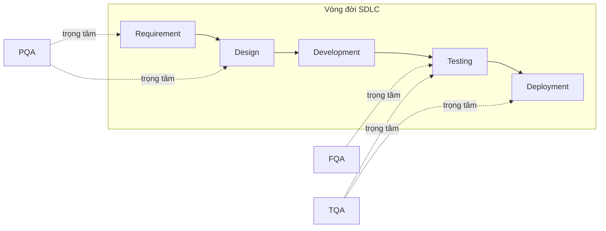

# Chương 4: PQA, FQA, TQA — phân biệt & trách nhiệm

## Mục tiêu học

- Phân biệt rõ 3 vai trò QA phổ biến trong ngành: PQA, FQA, TQA.
- Xác định được, với một hoạt động QA cụ thể, nó thuộc trách nhiệm của vai trò nào.
- Hiểu vì sao ở nhiều công ty (đặc biệt công ty nhỏ/vừa) một người thường kiêm nhiều vai trò —
  và đây chính là bối cảnh ra đời của "Automation QA Engineer" (Chương 5).

> Ví dụ: `code/ch04-pqa-fqa-tqa/responsibility-matrix.md` — ma trận trách nhiệm RACI áp dụng 3 vai
> trò vào từng hoạt động cụ thể của tính năng đăng nhập.

## 4.1. Ba vai trò, ba trọng tâm khác nhau

Ba thuật ngữ PQA, FQA, TQA không phải lúc nào cũng dùng thống nhất giữa các công ty (có nơi gọi
khác đi), nhưng trọng tâm công việc phía sau các thuật ngữ này khá nhất quán trong ngành:

### PQA — Product QA

Trọng tâm: **sản phẩm có đúng là thứ người dùng cần không?** PQA quan tâm đến góc nhìn nghiệp vụ
và trải nghiệm người dùng nhiều hơn là chi tiết kỹ thuật.

- Review yêu cầu (requirement) từ góc độ "điều này có hợp lý với người dùng thật không?"
- Review UX/UI, luồng sử dụng (user flow) có trực quan, hợp lý không.
- Thường tham gia sớm nhất trong SDLC (giai đoạn Requirement — xem lại Chương 1).

### FQA — Functional QA

Trọng tâm: **tính năng có hoạt động đúng theo yêu cầu đã định nghĩa không?** Đây là hình dung phổ
biến nhất khi nói "QA" — người viết và thực thi test case.

- Viết test case chi tiết (như bộ test case Chương 1).
- Test tay (manual) hoặc yêu cầu automation test cho từng case.
- Report bug khi phát hiện sai lệch (xem Chương 3).
- Trọng tâm chủ yếu ở giai đoạn Testing trong SDLC.

### TQA — Test/Technical QA

Trọng tâm: **hạ tầng và công cụ kiểm thử.** TQA là người viết code test (automation), xây dựng và
duy trì framework test, tích hợp test vào CI/CD.

- Viết automation test (Playwright, và các công cụ khác).
- Dựng framework test (Page Object Model — Chương 15, fixtures — Chương 16).
- Tích hợp test vào pipeline CI/CD (Chương 19).
- Phân tích test tự động fail: lỗi thật hay flaky test (test không ổn định)?

## 4.2. Ví dụ cụ thể: cùng một tính năng, ba góc nhìn khác nhau

Với tính năng "Đăng nhập" (đã dùng xuyên suốt Phần I):

- **PQA** hỏi: "Thông báo lỗi 'Email hoặc mật khẩu không đúng' có đủ thân thiện không, hay khiến
  người dùng bối rối? Có nên thêm link 'Quên mật khẩu' ngay cạnh đó không?"
- **FQA** hỏi: "Nếu tôi nhập sai mật khẩu, hệ thống có hiển thị đúng thông báo lỗi đó không? Nếu
  tôi để trống field, có bị chặn submit không?" — rồi thực thi bộ test case Chương 1 để trả lời.
- **TQA** hỏi: "Làm sao để 10 test case này chạy tự động mỗi khi có commit mới, và nếu một test
  fail trên CI, làm sao biết ngay đó là lỗi thật hay chỉ vì trang load chậm hôm nay (flaky)?"

Xem ma trận đầy đủ ở `code/ch04-pqa-fqa-tqa/responsibility-matrix.md` để thấy 8 hoạt động cụ thể
được phân định rõ giữa 3 vai trò này.

## 4.3. Vì sao một người thường kiêm nhiều vai trò?

Ở các công ty lớn, ba vai trò này có thể là ba vị trí (hoặc ba nhóm) riêng biệt. Nhưng ở phần lớn
công ty vừa và nhỏ — bối cảnh phổ biến nhất mà người đọc sách này sẽ làm việc — **một người
thường đảm nhiệm cả FQA lẫn TQA**: vừa viết test case, vừa tự động hoá chính test case đó bằng
Playwright.

Đây chính là chân dung công việc mà cuốn sách này nhắm tới: một **Automation QA Engineer** — người
hiểu đủ về nghiệp vụ để viết test case đúng (như FQA), và đủ kỹ năng lập trình để tự động hoá
chúng (như TQA). Chương 5 sẽ định nghĩa rõ vai trò này.

## Bài tập

1. Với bộ test case ở Chương 1 (`code/ch01-sdlc/test-case-list-login.md`), chọn 3 test case bất
   kỳ và xác định: viết test case này thuộc trách nhiệm FQA, thực thi bằng automation thuộc TQA —
   ai review UX của thông báo lỗi ở mỗi case đó (PQA)?
2. Nếu công ty bạn (hoặc công ty bạn biết) chỉ có 1-2 người làm QA cho cả team, hãy phác thảo:
   người đó cần dành bao nhiêu % thời gian cho công việc kiểu PQA, FQA, TQA?
3. Tìm một tin tuyển dụng "QA Engineer" hoặc "Automation Tester" thực tế (trên LinkedIn/ TopCV...),
   đối chiếu mô tả công việc với 3 vai trò ở chương này — vị trí đó nghiêng về vai trò nào nhất?

## Lỗi thường gặp

- **Coi PQA/FQA/TQA là 3 chức danh cố định, bắt buộc phải tách biệt**: trên thực tế đây là 3
  *loại trọng tâm công việc*, không phải chức danh — một người, một team nhỏ hoàn toàn có thể đảm
  nhiệm nhiều vai trò cùng lúc.
- **Nghĩ rằng TQA chỉ cần biết code, không cần hiểu nghiệp vụ**: một automation test viết đúng cú
  pháp nhưng test sai nghiệp vụ (do không hiểu rõ yêu cầu) vẫn là test vô giá trị — TQA giỏi vẫn
  cần tư duy như FQA khi thiết kế test case.

## Tóm tắt & tiếp theo

- PQA tập trung vào "đúng sản phẩm" (góc nhìn người dùng/nghiệp vụ).
- FQA tập trung vào "đúng tính năng theo yêu cầu" (viết & thực thi test case).
- TQA tập trung vào "hạ tầng kiểm thử" (automation, CI/CD).
- Automation QA Engineer — trọng tâm của sách này — thường là sự kết hợp giữa FQA và TQA.

Chương 5 định nghĩa cụ thể "Automation QA" là gì, và quan trọng hơn: khi nào nên tự động hoá một
test case, khi nào không nên.
