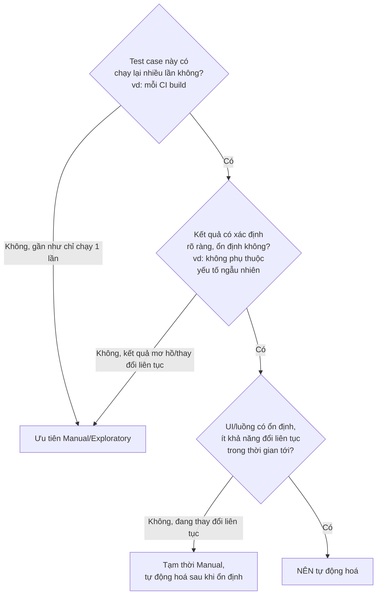

# Chương 5: Automation QA là gì? Khi nào nên tự động hoá, khi nào không

## Mục tiêu học

- Định nghĩa được Automation QA là gì, khác Manual QA ở điểm nào (không chỉ là "biết code").
- Áp dụng được một khung quyết định (decision framework) để trả lời: test case này có nên tự động
  hoá không?
- Tính toán được điểm hoà vốn (break-even point) giữa chi phí manual và automation.

> Code mẫu: `code/ch05-automation-qa-la-gi/roi-calculator.js` — công cụ tính ROI (return on
> investment) của việc tự động hoá một test case, dựa trên số lần dự kiến sẽ chạy lại nó.

## 5.1. Automation QA là gì?

**Automation QA** là hoạt động (và người thực hiện hoạt động đó) viết **code** để tự động thực thi
lại các kịch bản kiểm thử, thay vì con người thao tác tay từng bước.

Điều quan trọng cần làm rõ ngay: **Automation QA không phải là "QA nhưng biết code".** Một
Automation QA Engineer giỏi cần **cả hai** năng lực:

1. **Tư duy QA** (như FQA ở Chương 4): biết thiết kế test case tốt, biết nghĩ ra case biên, hiểu
   nghiệp vụ đủ sâu để biết test cái gì là quan trọng.
2. **Năng lực kỹ thuật** (như TQA ở Chương 4): viết code test có cấu trúc, bảo trì được, hiểu cách
   hệ thống hoạt động đủ để debug khi test fail.

Thiếu năng lực (1), bạn viết ra automation test đúng cú pháp nhưng test sai thứ cần test. Thiếu
năng lực (2), bạn có ý tưởng test tốt nhưng không tự động hoá được, hoặc tự động hoá ra một suite
test không ai bảo trì nổi.

## 5.2. Không phải mọi thứ đều nên tự động hoá

Đây là sai lầm phổ biến nhất của người mới học automation test: nghĩ rằng "tự động hoá càng nhiều
càng tốt". Thực tế, viết và bảo trì một automation test **tốn chi phí** (thời gian viết, thời gian
bảo trì khi UI/nghiệp vụ thay đổi, thời gian debug khi test flaky). Chi phí đó chỉ đáng bỏ ra nếu
test case đó **được chạy lại đủ nhiều lần**.



### Ví dụ nên tự động hoá

- Test case chạy trong **mọi lần build CI/CD** (regression suite) — như TC-01 đến TC-06 trong bộ
  test case Chương 1.
- Test case có kết quả **rõ ràng, xác định** (không mơ hồ kiểu "giao diện trông đẹp không").
- Luồng nghiệp vụ **ổn định**, không thay đổi liên tục mỗi sprint.

### Ví dụ chưa nên tự động hoá (hoặc automation không phải lựa chọn tốt nhất)

- Test **một lần duy nhất** cho một tính năng sắp bị gỡ bỏ tuần sau.
- **Exploratory testing** — bản chất là khám phá cái *chưa biết trước*, không có kịch bản cố định
  để tự động hoá.
- Đánh giá **UX/thẩm mỹ chủ quan** ("nút này có nổi bật không?") — máy không đánh giá được, cần
  con người.
- Tính năng **UI còn đang thay đổi liên tục** mỗi sprint — automation test sẽ vỡ liên tục, chi phí
  bảo trì vượt xa lợi ích, tốt hơn nên đợi UI ổn định.

## 5.3. Tính ROI: khi nào automation "hoà vốn"?

Câu hỏi định lượng hơn: viết automation test tốn thời gian ban đầu (setup cost) — vậy sau bao
nhiêu lần chạy lại thì khoản đầu tư đó "hoà vốn" so với việc cứ tiếp tục test tay?

Chạy `code/ch05-automation-qa-la-gi/roi-calculator.js` để thấy so sánh cụ thể giữa hai case đối
lập: một test case chạy trong mọi CI build (nên tự động hoá, hoà vốn rất nhanh) so với một luồng
nghiệp vụ hiếm gặp (chưa nên tự động hoá, vì gần như không có cơ hội "thu hồi" chi phí viết test).

Công thức cốt lõi (đơn giản hoá):

```
Tổng chi phí manual     = thời_gian_test_tay × số_lần_chạy_lại
Tổng chi phí automation = thời_gian_viết_test + (thời_gian_chạy_tự_động + thời_gian_bảo_trì) × số_lần_chạy_lại
```

Automation đáng giá khi **Tổng chi phí automation < Tổng chi phí manual** — và vì
`thời_gian_viết_test` là chi phí cố định một lần, số lần chạy lại càng nhiều, automation càng có
lợi (đường automation "phẳng" hơn nhiều so với đường manual tăng tuyến tính).

## Bài tập

1. Chạy `node roi-calculator.js`, thử đổi `numberOfRuns` trong case 2 (luồng hiếm gặp) tăng dần —
   tìm ra khoảng giá trị mà tại đó automation bắt đầu đáng giá hơn manual.
2. Với 10 test case ở `code/ch01-sdlc/test-case-list-login.md`, áp dụng sơ đồ quyết định ở mục 5.2:
   test case nào bạn sẽ tự động hoá trước tiên, test case nào để lại test tay (nếu có)?
3. Viết một case ROI cho một tính năng bạn từng làm, dùng `roi-calculator.js` làm mẫu, tự ước
   lượng các tham số và kết luận có nên tự động hoá không.

## Lỗi thường gặp

- **"Tự động hoá 100% test case" như một mục tiêu tự thân**: không phải mọi test đều đáng tự động
  hoá — xem mục 5.2. Coverage automation cao không đồng nghĩa với chất lượng test tốt.
- **Tự động hoá quá sớm khi UI còn đang thay đổi liên tục**: dẫn đến việc sửa lại automation test
  gần như mỗi sprint — tốn công hơn cả lợi ích mang lại, cho tới khi tính năng ổn định.
- **Bỏ qua chi phí bảo trì khi tính ROI**: chỉ tính thời gian viết test lần đầu mà quên chi phí
  sửa test mỗi khi UI đổi — khiến ROI thực tế thấp hơn nhiều so với ước tính ban đầu.

## Tóm tắt & tiếp theo

- Automation QA đòi hỏi cả tư duy QA (biết test gì) lẫn năng lực kỹthuật (biết tự động hoá thế nào).
- Không phải mọi test case đều nên tự động hoá — cần cân nhắc: tần suất chạy lại, độ ổn định kết
  quả, độ ổn định của UI/luồng nghiệp vụ.
- ROI của automation tăng theo số lần chạy lại — vì chi phí viết test là chi phí cố định một lần.

Chương 6 khép lại Phần II bằng việc đi sâu vào kỹ năng và tư duy cụ thể mà một Automation QA
Engineer cần rèn luyện — chuẩn bị nền tảng trước khi bước vào cài đặt môi trường và viết Playwright
thật ở Phần III–IV.
