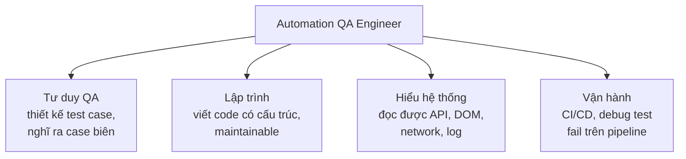

# Chương 6: Kỹ năng & tư duy cần có của một Automation QA Engineer

## Mục tiêu học

- Liệt kê được các nhóm kỹ năng cốt lõi của một Automation QA Engineer.
- Nhận diện được các "code smell" phổ biến trong automation test qua ví dụ thực tế.
- Hiểu vì sao "biết code" chỉ là điều kiện cần, chưa phải điều kiện đủ.

> Code mẫu: `code/ch06-ky-nang-automation-qa/` — hai file test cùng một kịch bản, viết theo hai tư
> duy khác nhau (`bad-example.spec.ts` vs `good-example.spec.ts`), với 5 vấn đề được đánh số đối
> chiếu trực tiếp.

## 6.1. Bốn nhóm kỹ năng cốt lõi

1. **Tư duy QA** (đã học ở Chương 1-4): thiết kế test case tốt, biết ưu tiên test gì trước, nghĩ ra
   case biên mà người viết code (dev) hay bỏ sót.
2. **Lập trình**: không cần giỏi thuật toán, nhưng cần viết code *rõ ràng, có cấu trúc, dễ bảo trì*
   — vì automation test cũng là code, và code test tệ cũng gây nợ kỹ thuật (technical debt) như
   code sản phẩm tệ.
3. **Hiểu hệ thống đang test**: đọc hiểu response API, cấu trúc DOM, network request — để biết
   *tại sao* một test fail (lỗi thật hay do cách viết test).
4. **Vận hành pipeline**: hiểu CI/CD đủ để tích hợp test vào, và quan trọng hơn — đủ để **debug**
   khi test fail trên CI nhưng lại pass trên máy local.

## 6.2. "Biết code" chỉ là điều kiện cần

So sánh `code/ch06-ky-nang-automation-qa/bad-example.spec.ts` và `good-example.spec.ts` — cả hai
đều là code Playwright *chạy được về mặt cú pháp*, nhưng thể hiện hai trình độ tư duy automation
rất khác nhau:

| # | Vấn đề (bad-example) | Cách sửa (good-example) | Kỹ năng liên quan |
|---|---|---|---|
| 1 | `waitForTimeout()` — chờ mù, đoán thời gian | `expect()` tự động chờ đến khi đúng điều kiện | Hiểu hệ thống (auto-waiting) |
| 2 | Locator theo cấu trúc DOM dễ vỡ | Locator theo vai trò/nhãn người dùng thấy | Lập trình (viết code bền vững) |
| 3 | Assertion mơ hồ, không khớp test case | Assertion cụ thể, đúng "Kết quả mong đợi" | Tư duy QA (nhớ lại Chương 3) |
| 4 | Lặp lại logic ở mọi test | Tách hàm dùng chung | Lập trình (không lặp code — DRY) |
| 5 | Test phụ thuộc thứ tự chạy | Mỗi test độc lập | Vận hành (test ổn định trên CI) |

Quan sát quan trọng: **Vấn đề 3** (assertion mơ hồ) không phải lỗi kỹ thuật — code đó vẫn chạy,
không báo lỗi cú pháp. Đây là lỗi **tư duy QA**: người viết quên rằng assertion phải khớp chính
xác với "Kết quả mong đợi" đã định nghĩa trong test case (Chương 3). Một lập trình viên giỏi
nhưng chưa quen tư duy QA rất dễ mắc lỗi này.

## 6.3. Vì sao code test tệ cũng nguy hiểm như code sản phẩm tệ?

Automation test là **code**, và cũng cần được đối xử như code sản phẩm: dễ đọc, dễ bảo trì, không
lặp lại. Một suite test viết tệ (như `bad-example.spec.ts`) gây ra hậu quả cụ thể:

- **Flaky test** (Vấn đề 1, 5): test đôi khi pass đôi khi fail dù code không đổi gì — dần dần đội
  ngũ mất niềm tin vào automation suite, tới mức bỏ qua khi nó báo fail ("chắc lại flaky thôi").
- **Vỡ hàng loạt khi UI đổi nhỏ** (Vấn đề 2): dev chỉ đổi class CSS, hàng chục test vỡ dù hành vi
  ứng dụng không đổi — tốn thời gian sửa test thay vì phát hiện lỗi thật.
- **Bảo trì cực khổ** (Vấn đề 4): sửa một domain/URL phải sửa ở hàng chục nơi, dễ sót.

## Bài tập

1. Đọc kỹ cả hai file trong `code/ch06-ky-nang-automation-qa/`, với mỗi "Vấn đề N", tự giải thích
   bằng lời của bạn (không nhìn comment) tại sao nó là vấn đề.
2. Tìm trong bad-example.spec.ts: nếu dev đổi `<button class="btn btn-primary">` thành `<button
   class="btn-submit">` (đổi tên class, hành vi không đổi), locator nào ở bad-example sẽ vỡ? Locator
   tương ứng ở good-example có bị ảnh hưởng không? Vì sao?
3. Tự đánh giá bản thân theo 4 nhóm kỹ năng ở mục 6.1 (thang điểm 1-5) — nhóm nào bạn cần rèn luyện
   thêm nhất trước khi bước vào Phần III–IV?

## Lỗi thường gặp

- **Học cú pháp Playwright trước, tư duy QA sau (hoặc bỏ qua)**: dẫn đến viết được test chạy được
  nhưng test sai thứ cần test — như Vấn đề 3 ở mục 6.2.
- **Copy-paste code test thay vì tách hàm dùng chung**: một thay đổi nhỏ (đổi URL, đổi selector)
  phải sửa ở rất nhiều nơi, dễ sót và tạo ra automation suite khó bảo trì theo thời gian.
- **Phớt lờ flaky test thay vì tìm nguyên nhân gốc**: chạy lại (retry) cho tới khi pass là cách xử
  lý tạm bợ phổ biến nhưng nguy hiểm — che giấu vấn đề thật (thường là Vấn đề 1 hoặc 5 ở trên) thay
  vì sửa nó.

## Tóm tắt & tiếp theo

- Automation QA Engineer cần 4 nhóm kỹ năng: tư duy QA, lập trình, hiểu hệ thống, vận hành pipeline.
- "Biết code" là điều kiện cần nhưng không đủ — code test đúng cú pháp vẫn có thể sai về tư duy QA.
- Code test cũng là code sản phẩm — cần viết rõ ràng, bền vững, không lặp lại.

Đến đây, Phần II (Vai trò QA & Automation QA) đã hoàn thành. Phần III bắt đầu phần thực hành: cài
đặt Node.js, khởi tạo project Playwright, và giới thiệu demo app sẽ dùng xuyên suốt phần còn lại
của sách — nơi hai file ví dụ ở chương này sẽ được chạy thật lần đầu tiên.
