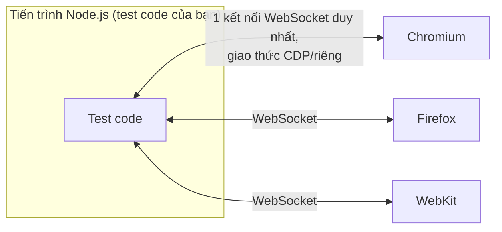

# Chương 10: Playwright là gì? Kiến trúc, so sánh nhanh với Selenium/Cypress

## Mục tiêu học

- Giải thích được Playwright là gì và cách nó điều khiển trình duyệt ở mức kiến trúc.
- So sánh được Playwright với Selenium và Cypress — biết khi nào công cụ nào phù hợp hơn.
- Hiểu vì sao Playwright giải quyết được vấn đề "flaky test" tốt hơn các công cụ cũ.

## 10.1. Playwright là gì?

**Playwright** là một framework automation test cho web, do Microsoft phát triển (mã nguồn mở),
cho phép điều khiển các trình duyệt thật (Chromium, Firefox, WebKit) bằng code — điều hướng, click,
điền form, và kiểm tra kết quả, đúng như những gì sách đã minh hoạ từ Chương 2 và Chương 6.

Ba đặc điểm kiến trúc quan trọng nhất phân biệt Playwright với các công cụ ra đời trước nó:

1. **Giao tiếp qua một kết nối WebSocket bền, không qua HTTP request-response rời rạc** (khác với
   Selenium WebDriver — xem 10.2) → độ trễ mỗi lệnh thấp hơn, ổn định hơn.
2. **Auto-waiting tích hợp sẵn ở mọi action/assertion** (`click()`, `fill()`, `expect()`) — tự động
   chờ phần tử "sẵn sàng" (tồn tại, hiển thị, không bị che, không bị disable) trước khi thao tác,
   không cần code thêm `sleep()`/`wait()` thủ công như đã thấy ở Vấn đề 1, Chương 6. Học chi tiết ở
   Chương 14.
3. **Một API, điều khiển được cả 3 engine trình duyệt** (Chromium, Firefox, WebKit — engine của
   Safari) — viết test một lần, chạy cross-browser mà không cần code riêng cho từng loại (Chương 24).

## 10.2. So sánh với Selenium

**Selenium WebDriver** (ra đời từ 2004, vẫn được dùng rộng rãi) giao tiếp với trình duyệt qua
**HTTP request/response** tới một "driver" riêng cho từng loại trình duyệt (ChromeDriver,
GeckoDriver...) — mỗi lệnh (`click`, `findElement`...) là một HTTP round-trip riêng biệt.

| Tiêu chí | Selenium WebDriver | Playwright |
|---|---|---|
| Giao tiếp với trình duyệt | HTTP request/response qua driver riêng từng browser | WebSocket bền, giao thức riêng tối ưu cho tốc độ |
| Auto-waiting | Không có sẵn — phải tự viết `WebDriverWait` hoặc `sleep()` | Có sẵn ở mọi action/assertion |
| Cài đặt driver | Phải tự quản lý version driver khớp version browser | `npx playwright install` tự lo, không cần driver riêng |
| Hỗ trợ ngôn ngữ | Rất nhiều (Java, Python, C#, JS, Ruby...) | Ít hơn (JS/TS, Python, .NET, Java) nhưng hỗ trợ chính thức, chất lượng cao |
| Trace/debug tích hợp | Không có sẵn, cần công cụ ngoài | Trace Viewer, UI Mode tích hợp sẵn (Chương 17) |

**Selenium vẫn có lý do tồn tại**: hệ sinh thái lâu đời hơn, hỗ trợ nhiều ngôn ngữ hơn, và nhiều hệ
thống legacy đã đầu tư sẵn vào nó. Nhưng cho project **mới**, đặc biệt trong hệ sinh thái JS/TS,
Playwright thường được khuyến nghị hơn vì auto-waiting giảm đáng kể flaky test.

## 10.3. So sánh với Cypress

**Cypress** cũng là công cụ hiện đại, cũng có auto-waiting, nhưng có khác biệt kiến trúc quan trọng:
Cypress chạy **bên trong** trình duyệt (cùng vòng lặp sự kiện với trang web đang test), còn
Playwright chạy **bên ngoài**, điều khiển trình duyệt qua giao thức riêng.

| Tiêu chí | Cypress | Playwright |
|---|---|---|
| Đa trình duyệt | Chrome/Edge (Chromium) tốt nhất; Firefox/WebKit hỗ trợ hạn chế hơn | Chromium, Firefox, WebKit đầy đủ, chính thức |
| Đa tab/đa domain trong 1 test | Hạn chế (do chạy trong cùng trình duyệt với trang test) | Hỗ trợ tốt (nhiều `page`, nhiều `context` cùng lúc) |
| Chạy song song nhiều test | Cần Cypress Cloud (trả phí) để chia song song hiệu quả | Có sẵn miễn phí qua `fullyParallel` + sharding (Chương 23) |
| Ngôn ngữ | Chỉ JavaScript/TypeScript | JS/TS, Python, .NET, Java |
| API testing tích hợp | Có, nhưng khác API cho UI test | Cùng một API (`request` context) cho cả API và UI test (Chương 20) |

## 10.4. Vì sao sách này chọn Playwright?

- **Miễn phí, mã nguồn mở, không giới hạn tính năng** (khác Cypress Cloud cho việc chạy song song
  quy mô lớn).
- **Auto-waiting mặc định** giải quyết trực tiếp nhóm lỗi phổ biến nhất mà Chương 6 đã minh hoạ
  (Vấn đề 1: `waitForTimeout`).
- **Trace Viewer + UI Mode tích hợp sẵn** (Chương 17) — công cụ debug mạnh mà không cần cài thêm gì.
- **Hỗ trợ TypeScript first-class** — phù hợp với đối tượng độc giả đã biết JS cơ bản của sách này.

## Bài tập

1. Đọc lại `code/playwright-tests/tests/ch09-demo-app-smoke.spec.ts` — xác định 3 điểm trong code
   đó thể hiện đặc điểm "auto-waiting" (gợi ý: chú ý những nơi *không* có `waitForTimeout`).
2. Nếu bạn từng dùng Selenium hoặc Cypress trước đây, viết ra 2 điểm khác biệt lớn nhất bạn nhận
   thấy khi đọc code Playwright ở các chương trước.
3. Tra cứu: Playwright hỗ trợ chính thức bao nhiêu ngôn ngữ lập trình? Vì sao sách này chọn
   TypeScript trong số đó?

## Lỗi thường gặp

- **Nghĩ Playwright chỉ chạy được Chromium**: đây là engine phổ biến nhất và mặc định trong ví dụ,
  nhưng Playwright hỗ trợ đầy đủ cả Firefox và WebKit (xem Chương 24).
- **So sánh công cụ dựa trên ấn tượng cũ** (ví dụ "Selenium chậm, lỗi thời"): mỗi công cụ có điểm
  mạnh riêng theo bối cảnh (ngôn ngữ, hệ thống legacy) — quan trọng là hiểu *sự khác biệt kiến trúc*
  dẫn đến khác biệt hành vi, không phải học vẹt "công cụ nào tốt hơn".

## Tóm tắt & tiếp theo

- Playwright điều khiển trình duyệt qua kết nối bền (không phải HTTP rời rạc như Selenium), có
  auto-waiting sẵn, và hỗ trợ cross-browser bằng một API duy nhất.
- So với Selenium: Playwright giảm flaky test nhờ auto-waiting, không cần quản lý driver riêng.
- So với Cypress: Playwright hỗ trợ cross-browser và chạy song song tốt hơn, miễn phí hoàn toàn.

Chương 11 bắt đầu viết test thật đầu tiên một cách bài bản: locators, actions, và assertions — nền
tảng của mọi automation test Playwright từ đây đến hết sách.
