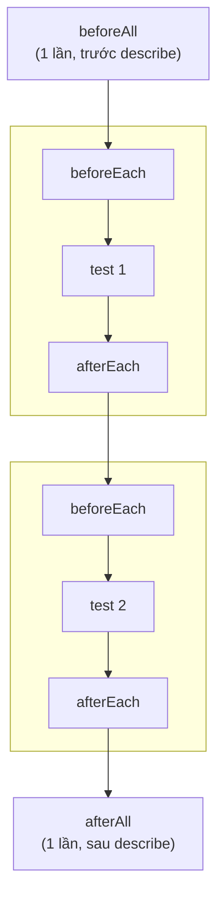

# Chương 12: Cấu trúc test — `test`, `describe`, hooks (`beforeEach`/`afterEach`)

## Mục tiêu học

- Nhóm các test liên quan bằng `test.describe`.
- Dùng đúng 4 loại hook: `beforeAll`, `afterAll`, `beforeEach`, `afterEach` — biết loại nào chạy
  khi nào.
- Chia nhỏ một test dài thành các bước có tên bằng `test.step`.

> Code mẫu: `code/playwright-tests/tests/ch12-cau-truc-test.spec.ts` — 3 test cho khu vực sau đăng
> nhập (Dashboard, Đơn hàng, Đăng xuất), tổ chức bằng `describe` + đủ 4 loại hook.

## 12.1. `test.describe` — nhóm các test liên quan

```ts
test.describe("Khu vực sau đăng nhập (Dashboard & Đơn hàng)", () => {
  test("hiển thị đúng tên người dùng trên Dashboard", async ({ page }) => { /* ... */ });
  test("điều hướng sang trang Đơn hàng", async ({ page }) => { /* ... */ });
});
```

`describe` không bắt buộc — Chương 11 vẫn viết được 10 test mà không cần nó. Nhưng khi nhiều test
**dùng chung một điều kiện tiền đề** (ở đây: "đã đăng nhập"), gom chúng vào một `describe` cho phép
dùng chung hook `beforeEach`, tránh lặp lại code đăng nhập ở từng test (đúng tinh thần "Sửa 4",
Chương 6: tách logic dùng chung).

## 12.2. Bốn loại hook — chạy khi nào?



| Hook | Chạy khi nào | Dùng để làm gì |
|---|---|---|
| `beforeAll` | Đúng 1 lần, trước test đầu tiên trong `describe` | Log, thiết lập tài nguyên dùng chung (hiếm dùng để chuẩn bị dữ liệu — xem cảnh báo dưới) |
| `beforeEach` | Trước **mỗi** test | Đưa mỗi test về cùng điều kiện xuất phát (ở đây: đăng nhập sẵn) |
| `afterEach` | Sau **mỗi** test | Dọn dẹp, log kết quả, chụp ảnh khi fail (Chương 17) |
| `afterAll` | Đúng 1 lần, sau test cuối cùng | Log tổng kết, đóng tài nguyên dùng chung |

**Cảnh báo quan trọng:** *không* dùng `beforeAll` để chuẩn bị dữ liệu mà từng test sẽ **thay đổi**.
Vì `beforeAll` chỉ chạy 1 lần, nếu test đầu tiên làm thay đổi dữ liệu đó (ví dụ đổi mật khẩu), các
test sau sẽ nhận dữ liệu đã bị thay đổi — vi phạm nguyên tắc "test độc lập" (Vấn đề 5, Chương 6).
Đây là lý do `code/playwright-tests/tests/ch12-cau-truc-test.spec.ts` dùng `beforeEach` (không phải
`beforeAll`) để đăng nhập lại **từ đầu, sạch sẽ** cho từng test — dù có hơi chậm hơn (đăng nhập lại
mỗi lần) nhưng an toàn hơn nhiều.

## 12.3. `afterEach` với `testInfo` — biết test vừa pass hay fail

```ts
test.afterEach(async ({}, testInfo) => {
  if (testInfo.status !== testInfo.expectedStatus) {
    console.log(`Test "${testInfo.title}" FAILED — xem trace để debug (Chương 17)`);
  }
});
```

`testInfo` là tham số thứ hai mọi hook/test đều nhận được, chứa thông tin về test đang chạy:
`title`, `status` (kết quả thực tế), `expectedStatus` (thường là `"passed"`, trừ khi dùng
`test.fail()`). So sánh hai giá trị này là cách chuẩn để biết "test này có đang fail không" bên
trong hook — nền tảng cho kỹ thuật tự động lưu ảnh chụp khi fail ở Chương 17.

## 12.4. `test.step` — chia nhỏ test dài thành các bước có tên

```ts
test("điều hướng sang trang Đơn hàng", async ({ page }) => {
  await test.step("Click vào link Đơn hàng", async () => {
    await page.getByRole("link", { name: "Đơn hàng" }).click();
  });
  await test.step("Xác nhận đã ở trang Đơn hàng", async () => {
    await expect(page).toHaveURL("/orders");
    await expect(page.locator("#orders-empty")).toBeVisible();
  });
});
```

`test.step` không thay đổi hành vi chạy test — nhưng khi xem báo cáo HTML hoặc Trace Viewer
(Chương 17-18), mỗi bước hiện ra như một dòng riêng, có tên rõ ràng, giúp xác định **chính xác
bước nào fail** trong một test dài, thay vì phải đọc lại toàn bộ code test để đoán.

## Bài tập

1. Chạy `npm test` trong `code/playwright-tests/`, xác nhận cả 17 test (Chương 8, 9, 11, 12) pass,
   quan sát 2 dòng log `beforeAll`/`afterAll` xuất hiện đúng 1 lần mỗi dòng trong toàn bộ output.
2. Trong `ch12-cau-truc-test.spec.ts`, thử đổi `beforeEach` thành `beforeAll` (chỉ đăng nhập 1 lần
   cho cả 3 test), chạy lại `npm test` — quan sát điều gì xảy ra (gợi ý: mỗi test dùng `page` mới
   do Playwright tự tạo — session đăng nhập có được giữ qua các `page` khác nhau không?).
3. Thêm một `test.step` thứ ba vào test "đăng xuất quay lại trang đăng nhập" để tách rõ bước "click
   Đăng xuất" và bước "xác nhận URL" như ví dụ ở mục 12.4.
4. Viết một `describe` mới, gom 3 test TC-04/05/06 (validation) từ `ch11-login-test-cases.spec.ts`
   vào, dùng `beforeEach` chung để `page.goto("/login")` (vốn đang lặp lại ở từng test đó).

## Lỗi thường gặp

- **Dùng `beforeAll` để chuẩn bị dữ liệu bị test sau đó thay đổi**: gây phụ thuộc thứ tự chạy giữa
  các test — xem cảnh báo ở mục 12.2.
- **Lồng quá nhiều `describe` không cần thiết**: làm code khó đọc hơn thay vì dễ hơn — chỉ nhóm khi
  các test thực sự dùng chung tiền đề/hook, không nhóm chỉ vì "cùng chủ đề" mà tiền đề khác nhau.
- **Quên rằng mỗi test có `page` (và toàn bộ browser context) riêng biệt**: trạng thái đăng nhập
  không tự động "giữ lại" giữa các test dù nằm cùng `describe`, trừ khi dùng kỹ thuật storage state
  (Chương 22) — đây chính là lý do bài tập 2 ở trên cho ra kết quả bất ngờ.

## Tóm tắt & tiếp theo

- `test.describe` nhóm các test dùng chung tiền đề, cho phép dùng chung hook.
- 4 loại hook: `beforeAll`/`afterAll` (1 lần), `beforeEach`/`afterEach` (mỗi test) — chọn đúng loại
  tuỳ dữ liệu có bị test làm thay đổi hay không.
- `test.step` chia nhỏ test dài thành các bước có tên, giúp đọc báo cáo/trace dễ hơn nhiều.

Chương 13 áp dụng toàn bộ kiến thức locators/actions/assertions/cấu trúc test vào một nhóm thao tác
UI phức tạp hơn: form với nhiều loại input, dropdown, và upload file.
