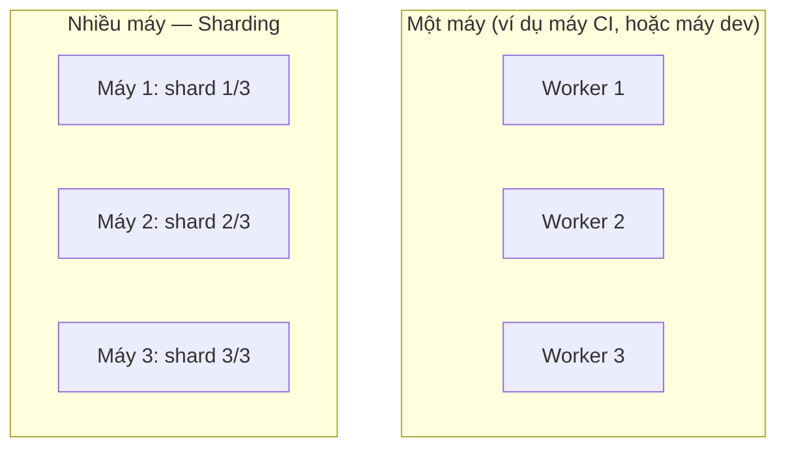

# Chương 23: Chạy song song, sharding, tối ưu tốc độ test suite

## Mục tiêu học

- Phân biệt **workers** (chạy song song trong một máy) và **sharding** (chia test suite ra nhiều
  máy/CI job khác nhau).
- Áp dụng kỹ thuật đúng để chạy song song an toàn: mỗi worker seed dữ liệu riêng.
- Thực sự bật lại chạy song song (đã tạm né từ Chương 11) — kiểm chứng bằng `--workers=4` chạy ổn
  định nhiều lần liên tiếp.

> Code mẫu: `code/playwright-tests/tests/ch23-song-song-sharding.spec.ts` — đã kiểm chứng thật:
> chạy `--workers=4` liên tiếp 4 lần, luôn "4 passed", không một lần flaky.

## 23.1. Workers vs Sharding — hai khái niệm khác nhau



| | Workers | Sharding |
|---|---|---|
| Chạy song song ở đâu | Nhiều tiến trình, CÙNG một máy | Chia test ra NHIỀU máy/job CI khác nhau |
| Giới hạn bởi | Số CPU core của máy đó | Số máy/job có thể chạy đồng thời (thường không giới hạn nhiều như CPU) |
| Cấu hình | `workers` trong config, hoặc `--workers=N` | `--shard=1/3`, `--shard=2/3`, `--shard=3/3` (chạy trên 3 job riêng) |

Hai kỹ thuật này **kết hợp được với nhau**: mỗi shard (mỗi máy CI) lại tự chạy nhiều worker song
song bên trong nó — tổng số test chạy đồng thời = số shard × số worker mỗi shard.

## 23.2. Sharding trong GitHub Actions

```yaml
# .github/workflows/playwright.yml — mở rộng để chạy 3 shard song song
strategy:
  matrix:
    shard: [1, 2, 3]
steps:
  # ... các bước cài đặt như Chương 19 ...
  - name: Run Playwright tests (shard ${{ matrix.shard }}/3)
    working-directory: code/playwright-tests
    run: npx playwright test --shard=${{ matrix.shard }}/3
```

`strategy.matrix` của GitHub Actions tạo ra **3 job chạy song song**, mỗi job nhận một phần
`--shard`. Với suite hiện tại (44 test, chạy vài chục giây), sharding chưa cần thiết — nhưng với
suite hàng nghìn test (nhiều giờ nếu chạy tuần tự), sharding là kỹ thuật bắt buộc để giữ thời gian
CI hợp lý.

## 23.3. Vấn đề đã né từ Chương 11: chạy song song trên dữ liệu dùng chung

Nhắc lại: từ Chương 11, `playwright.config.ts` đặt `workers: 1` vì mọi test dùng chung tài khoản
`demo@example.com` — chạy song song gây đụng độ trạng thái (TC-07 fail ngẫu nhiên). Đây **không**
phải hạn chế của Playwright — đây là hạn chế của **cách thiết kế dữ liệu test** dùng chung một tài
khoản cho mọi test.

## 23.4. Giải pháp đúng: mỗi worker seed tài khoản riêng

```ts
// server.js — endpoint mới (Chương 23)
app.post("/api/test/create-user", (req, res) => {
  const { email, password } = req.body || {};
  createUser(email, password); // tạo tài khoản MỚI, độc lập với demo@example.com
  res.json({ ok: true });
});
```

```ts
// ch23-song-song-sharding.spec.ts
test.describe("Chạy song song an toàn — mỗi worker một tài khoản riêng", () => {
  test.describe.configure({ mode: "parallel" }); // ghi đè fullyParallel:false của config gốc

  test.beforeEach(async ({ request }, testInfo) => {
    const email = `worker${testInfo.parallelIndex}@example.com`; // KHÁC nhau giữa các worker
    await request.post("/api/test/create-user", { data: { email, password: "Password123!" } });
  });

  test("...", async ({ page }, testInfo) => {
    const email = `worker${testInfo.parallelIndex}@example.com`;
    // đăng nhập, thao tác... — KHÔNG BAO GIỜ đụng tài khoản của worker khác
  });
});
```

`testInfo.parallelIndex` là chỉ số (0, 1, 2...) **đảm bảo khác nhau** giữa các worker đang chạy
đồng thời — dùng nó để tạo email riêng cho từng worker, mỗi worker có "vùng dữ liệu" hoàn toàn
tách biệt. Kiểm chứng thật:

```bash
npx playwright test ch23-song-song-sharding --workers=4
# Running 4 tests using 4 workers
#   4 passed (3.4s)
```

Chạy lại lệnh này **4 lần liên tiếp** khi viết chương này — luôn `4 passed`, không một lần flaky
(khác hẳn TC-07 ở Chương 11 khi chạy song song trên tài khoản chung).

## 23.5. Vì sao chỉ áp dụng cho chương này, chưa áp dụng lại cho TOÀN BỘ suite?

Đây là điểm cần trung thực: 22 chương trước (`ch11` đến `ch22`) đều hard-code
`demo@example.com` — để bật song song an toàn cho **toàn bộ** suite, mỗi file đó cần refactor để
dùng tài khoản riêng theo worker, giống kỹ thuật ở mục 23.4. Đây là công việc có thật, nhưng **nằm
ngoài phạm vi một chương** — sách chọn cách trung thực hơn: giữ `workers: 1` là mặc định (an toàn
cho toàn bộ suite hiện tại), và dùng `test.describe.configure({ mode: "parallel" })` như một ngoại
lệ có chủ đích cho nhóm test đã được thiết kế đúng để chạy song song.

**Bài học quan trọng hơn kỹ thuật cụ thể:** chạy song song an toàn là vấn đề **thiết kế dữ liệu
test** trước khi là vấn đề cấu hình Playwright — nếu thiết kế mọi test độc lập dữ liệu từ đầu
(giống Chương 23), không cần "sửa lại" gì cả.

## Bài tập

1. Chạy `npx playwright test ch23-song-song-sharding --workers=4` vài lần liên tiếp, xác nhận luôn
   `4 passed`.
2. Thử áp dụng kỹ thuật ở mục 23.4 để refactor `ch16-fixtures-co-ban.spec.ts` (dùng fixture
   `loggedInPage`) sang dùng tài khoản riêng theo worker — đây chính là bước đầu của việc "mở rộng
   ra toàn bộ suite" nói ở mục 23.5.
3. Đọc kỹ cấu hình `strategy.matrix` ở mục 23.2 — nếu suite có 300 test, chia làm 3 shard, mỗi
   shard chạy trên máy 4 core (workers=4), tối đa bao nhiêu test chạy đồng thời tại một thời điểm?
4. Giải thích: vì sao sharding không giải quyết được vấn đề "đụng độ dữ liệu chung" như ở Chương 11
   — dù chia ra nhiều máy, các test trong CÙNG một shard vẫn có thể đụng độ nếu vẫn dùng chung một
   tài khoản.

## Lỗi thường gặp

- **Tưởng tăng `workers` là luôn tăng tốc, không rủi ro gì**: nếu dữ liệu test không được thiết kế
  độc lập (như phần lớn suite hiện tại), tăng `workers` chỉ tái tạo lại chính xác vấn đề đã gặp ở
  Chương 11.
- **Nhầm sharding với workers**: sharding chia theo MÁY, workers chia theo TIẾN TRÌNH trong một
  máy — cấu hình sai chỗ (ví dụ tưởng `--shard` thay thế được `workers`) dẫn đến hiểu sai về mức độ
  song song thực tế.
- **Dùng `testInfo.workerIndex` thay vì `testInfo.parallelIndex`**: `workerIndex` có thể đổi giá
  trị khi Playwright khởi động lại worker (ví dụ sau khi retry), không đảm bảo tính duy nhất giữa
  các worker đang chạy đồng thời như `parallelIndex`.

## Tóm tắt & tiếp theo

- Workers chạy song song trong một máy; sharding chia suite ra nhiều máy — hai kỹ thuật độc lập,
  kết hợp được với nhau.
- Chạy song song an toàn đòi hỏi mỗi worker có dữ liệu test độc lập — `testInfo.parallelIndex` là
  cách chuẩn để tạo định danh duy nhất theo worker.
- Kiểm chứng thật bằng `--workers=4` chạy lặp lại nhiều lần là cách xác nhận đáng tin cậy hơn đọc
  lý thuyết suông.

Chương 24 chuyển sang một trục mở rộng khác: chạy CÙNG một bộ test trên nhiều trình duyệt
(Chromium, Firefox, WebKit) và giả lập thiết bị di động.
