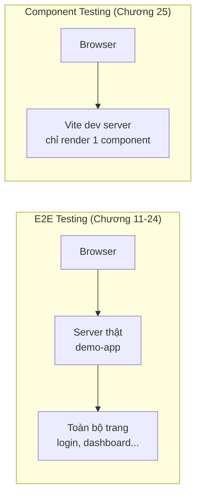

# Chương 25: Component testing với Playwright

## Mục tiêu học

- Hiểu component testing khác E2E testing (Chương 11-24) ở điểm cốt lõi nào.
- Cài đặt và chạy được `@playwright/experimental-ct-react` từ đầu.
- Viết test render một component React độc lập, không cần server hay trang nào.

> Code mẫu: `code/component-testing/` — project **riêng biệt**, độc lập với `demo-app` và
> `playwright-tests`. Đã kiểm chứng thật: `npm test` build bằng Vite, mount component trong
> Chromium thật, 2/2 test pass.

## 25.1. Component testing khác E2E testing ở đâu?

Toàn bộ Phần IV-V tới giờ là **E2E testing**: mở trình duyệt, điều hướng tới một **URL thật** của
một **ứng dụng đang chạy** (`demo-app`), thao tác như người dùng thật. **Component testing** khác
hẳn: render **một component UI đơn lẻ** (không phải cả trang, không cần server), kiểm tra hành vi
của riêng nó.



Component testing chỉ áp dụng được cho dự án dùng **framework component** (React, Vue, Svelte) —
`demo-app` của sách (HTML thuần + vanilla JS) **không** có khái niệm "component" theo nghĩa này,
nên chương này dùng một project React nhỏ, riêng biệt, để minh hoạ đúng kỹ thuật.

## 25.2. Cài đặt từ đầu

```bash
mkdir component-testing && cd component-testing
npm init -y
npm install -D @playwright/experimental-ct-react react react-dom @types/react @types/react-dom
npx playwright install chromium
```

Cấu hình riêng biệt với `playwright.config.ts` thông thường — dùng file `playwright-ct.config.ts`:

```ts
// playwright-ct.config.ts
import { defineConfig, devices } from "@playwright/experimental-ct-react";

export default defineConfig({
  testDir: "./tests",
  use: { ctPort: 3100 },
  projects: [{ name: "chromium", use: { ...devices["Desktop Chrome"] } }],
});
```

Và 2 file "bootstrap" bắt buộc (Playwright dùng để dựng trang HTML tạm render component):

```
playwright/index.html   — HTML rỗng, chỉ có <div id="root">
playwright/index.tsx    — nơi import CSS toàn cục nếu cần (để trống nếu không cần)
```

## 25.3. Viết component và test

```tsx
// src/PasswordField.tsx — tái hiện hành vi hiện/ẩn mật khẩu của demo-app (Chương 9)
import { useState } from "react";

type PasswordFieldProps = {
  label: string;
  value: string;
  onChange: (value: string) => void;
};

export function PasswordField({ label, value, onChange }: PasswordFieldProps) {
  const [visible, setVisible] = useState(false);
  return (
    <div>
      <label htmlFor="password-field">{label}</label>
      <input
        id="password-field"
        type={visible ? "text" : "password"}
        value={value}
        onChange={(e) => onChange(e.target.value)}
      />
      <button aria-label={visible ? "Ẩn ký tự" : "Hiện ký tự"} onClick={() => setVisible((v) => !v)}>
        👁
      </button>
    </div>
  );
}
```

```tsx
// tests/PasswordField.spec.tsx
import { test, expect } from "@playwright/experimental-ct-react";
import { PasswordField } from "../src/PasswordField";

test("mặc định ẩn mật khẩu, bấm nút để hiện ký tự", async ({ mount }) => {
  const component = await mount(<PasswordField label="Mật khẩu" value="" onChange={() => {}} />);

  const input = component.getByLabel("Mật khẩu");
  await expect(input).toHaveAttribute("type", "password");

  await component.getByRole("button", { name: "Hiện ký tự" }).click();
  await expect(input).toHaveAttribute("type", "text");
});
```

`mount()` — điểm khác biệt cốt lõi so với `page.goto()` — **render trực tiếp** component React
này vào một trang tạm (thông qua Vite), trả về một handle giống `Locator`, dùng được
`getByLabel`/`getByRole` như bình thường.

Chạy:

```bash
npm test
```

Output thật khi chạy chương này: Vite build component (`✓ built in 633ms`), rồi Playwright mount
và chạy test trong Chromium — `2 passed`.

## 25.4. Khi nào dùng component testing, khi nào dùng E2E?

| | Component Testing | E2E Testing |
|---|---|---|
| Tốc độ | Rất nhanh (không cần server, không điều hướng) | Chậm hơn (cần server, trang đầy đủ) |
| Phạm vi | Một component, cô lập | Toàn bộ luồng người dùng thật |
| Phát hiện lỗi tích hợp (routing, API thật, session...) | Không | Có |
| Phù hợp với | Component tái sử dụng nhiều nơi (button, form field, modal...) | Luồng nghiệp vụ hoàn chỉnh (đăng nhập, thanh toán...) |

Nhắc lại Testing Pyramid (Chương 2): component testing nằm **giữa** unit test và E2E test về mặt
tốc độ/phạm vi — hợp lý để viết nhiều component test cho các component dùng lại nhiều nơi, thay vì
chỉ dựa vào E2E test để gián tiếp kiểm tra chúng.

## Bài tập

1. Chạy `npm install && npx playwright install chromium && npm test` trong
   `code/component-testing/`, xác nhận 2 test pass.
2. Thêm một prop `disabled?: boolean` vào `PasswordField`, khi `true` thì input và nút đều bị vô
   hiệu hoá — viết test xác nhận bằng `toBeDisabled()`.
3. So sánh thời gian chạy `npm test` ở đây với thời gian chạy toàn bộ `code/playwright-tests/` —
   giải thích vì sao component testing nhanh hơn đáng kể dù đều "mở trình duyệt thật".
4. Nếu dự án của bạn dùng Vue hoặc Svelte thay vì React, tìm package tương ứng
   (`@playwright/experimental-ct-vue`, `@playwright/experimental-ct-svelte`) — cấu hình có gì
   khác so với bản React ở chương này?

## Lỗi thường gặp

- **Tưởng component testing thay thế được E2E testing**: hai kỹ thuật bổ trợ nhau — component
  testing không phát hiện được lỗi tích hợp giữa các phần (routing, API thật, session...), những
  thứ chỉ E2E test (Chương 11-24) mới kiểm tra được.
- **Thiếu file `playwright/index.html`/`index.tsx`**: đây là 2 file bootstrap bắt buộc, quên tạo
  sẽ khiến Playwright báo lỗi không tìm được entry point khi build bằng Vite.
- **Áp dụng component testing cho dự án không dùng framework component**: như `demo-app` của sách
  (HTML thuần) — kỹ thuật này chỉ áp dụng được khi UI được viết bằng React/Vue/Svelte thật.

## Tóm tắt & tiếp theo

- Component testing render một component UI độc lập bằng Vite, không cần server backend.
- `mount()` thay cho `page.goto()`; locator (`getByLabel`, `getByRole`) dùng giống hệt E2E testing.
- Chỉ áp dụng được cho dự án dùng framework component; bổ trợ (không thay thế) E2E testing.

Chương 26 — chương cuối Phần V — học cách viết custom fixture nâng cao và reporter riêng, hoàn
thiện các kỹ thuật tổ chức test đã học từ Chương 15-16.
