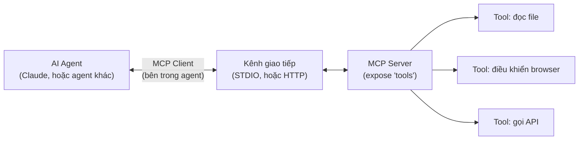

# Chương 27: Model Context Protocol (MCP) là gì, vì sao liên quan đến automation test

## Mục tiêu học

- Giải thích được MCP là gì, ở mức kiến trúc client-server.
- Phân biệt "tool" trong MCP với hàm thông thường — vì sao AI agent gọi được nó.
- Tự viết và chạy được một MCP server + client tối giản, thấy toàn bộ luồng giao tiếp thật.

> Code mẫu: `code/mcp-basics/` — MCP server/client chạy được thật, đã kiểm chứng: liệt kê tool,
> gọi tool, nhận kết quả — không phải mô tả lý thuyết suông.

## 27.1. MCP là gì?

**Model Context Protocol (MCP)** là một giao thức mở (do Anthropic khởi xướng, hiện được nhiều AI
agent hỗ trợ) định nghĩa cách một **AI agent** (như Claude) giao tiếp với các **công cụ bên
ngoài** — đọc file, gọi API, điều khiển trình duyệt, truy vấn database — theo một chuẩn thống
nhất, thay vì mỗi công cụ phải viết tích hợp riêng cho mỗi AI khác nhau.



Ba khái niệm cốt lõi:

- **MCP Server** — chương trình expose một tập **tool** (và có thể cả "resource", "prompt") mà
  agent có thể gọi tới. Đây là phần **bạn** (hoặc người khác) viết ra.
- **MCP Client** — phần nằm **bên trong** AI agent, biết cách kết nối tới MCP server, liệt kê tool
  có sẵn, và gọi chúng khi AI quyết định cần dùng.
- **Tool** — một hàm có **tên, mô tả, schema tham số rõ ràng** — AI đọc mô tả này để quyết định
  "tool nào phù hợp với việc cần làm", rồi gọi với tham số đúng định dạng.

## 27.2. Vì sao liên quan đến automation test?

Chương 28 sẽ dùng **Playwright MCP server** — một MCP server chính thức expose các tool như
"mở trang", "click", "điền form" — cho phép AI agent **tự điều khiển trình duyệt** để thực hiện
tác vụ, hoặc hỗ trợ sinh code test (Chương 29). Hiểu MCP ở chương này là nền tảng bắt buộc trước
khi dùng được Playwright MCP server một cách có chủ đích, không chỉ làm theo hướng dẫn mà không
hiểu cơ chế bên dưới.

## 27.3. Viết một MCP server tối giản

```js
// server.js
import { McpServer } from "@modelcontextprotocol/sdk/server/mcp.js";
import { StdioServerTransport } from "@modelcontextprotocol/sdk/server/stdio.js";
import { readFileSync } from "fs";

const server = new McpServer({ name: "book-demo-mcp-server", version: "1.0.0" });

server.registerTool(
  "count_login_test_cases",
  {
    title: "Đếm test case đăng nhập",
    description: "Đếm số test case (TC-xx) trong bộ test case đăng nhập ở Chương 1.",
    inputSchema: {}, // tool này không cần tham số
  },
  async () => {
    const content = readFileSync("../ch01-sdlc/test-case-list-login.md", "utf8");
    const ids = [...new Set(content.match(/\bTC-\d+\b/g) || [])];
    return { content: [{ type: "text", text: `Có ${ids.length} test case: ${ids.join(", ")}.` }] };
  }
);

const transport = new StdioServerTransport();
await server.connect(transport); // lắng nghe qua STDIO — cách phổ biến nhất cho MCP server local
```

Ba phần bắt buộc của một tool: **tên** (để agent gọi), **description** (để agent — thực chất là
LLM — hiểu tool này dùng để làm gì và quyết định có nên gọi không), và **inputSchema** (định nghĩa
tham số bằng Zod — agent biết chính xác cần truyền gì).

## 27.4. Viết một MCP client tối giản (đóng vai AI agent)

```js
// client.js
import { Client } from "@modelcontextprotocol/sdk/client/index.js";
import { StdioClientTransport } from "@modelcontextprotocol/sdk/client/stdio.js";

const transport = new StdioClientTransport({ command: "node", args: ["server.js"] });
const client = new Client({ name: "book-demo-mcp-client", version: "1.0.0" });
await client.connect(transport);

const { tools } = await client.listTools(); // agent tự "khám phá" tool có sẵn
console.log(tools.map((t) => t.name));

const result = await client.callTool({ name: "count_login_test_cases", arguments: {} });
console.log(result.content[0].text);
```

Đây **chính xác** là cách một AI agent thật (Claude hay bất kỳ AI hỗ trợ MCP nào) giao tiếp với
MCP server — không có bước "ma thuật" nào khác. Chạy thử:

```bash
cd code/mcp-basics
npm install
npm run demo
```

Output thật (đã kiểm chứng khi viết chương):

```
=== 1. Danh sách tool mà server này cung cấp ===
- count_login_test_cases: ...
- get_test_case_detail: ...

=== 2. Gọi tool count_login_test_cases ===
Bộ test case đăng nhập (Chương 1) có 10 test case: TC-01, TC-02, ..., TC-10.
```

## Bài tập

1. Chạy `npm install && npm run demo` trong `code/mcp-basics/`, xác nhận output khớp như trên.
2. Đọc `server.js`, thêm một tool mới `list_all_bugs` — đọc
   `code/ch03-test-case-plan-bug/bug-report-example.md`, trả về ID và tiêu đề bug tìm được trong
   file đó.
3. Chạy `client.js` sau khi thêm tool mới, gọi thử tool đó — xác nhận `listTools()` hiện đủ 3 tool.
4. Giải thích bằng lời của bạn: nếu `description` của một tool viết mơ hồ (ví dụ chỉ ghi "xử lý dữ
   liệu"), điều gì có thể xảy ra khi một AI agent thật cố quyết định có nên gọi tool đó không?

## Lỗi thường gặp

- **Viết `description` tool quá ngắn/mơ hồ**: AI agent dựa hoàn toàn vào text mô tả để quyết định
  gọi tool nào — mô tả mơ hồ dẫn đến agent gọi sai tool, hoặc không gọi tool đúng khi cần.
- **Nhầm MCP server với một REST API thông thường**: MCP có giao thức riêng (JSON-RPC qua STDIO
  hoặc HTTP), không gọi trực tiếp như `fetch()` một REST endpoint — cần dùng SDK/Client đúng cách.
- **Quên `await server.connect(transport)`**: server sẽ không lắng nghe được request nào, client
  kết nối tới sẽ treo hoặc lỗi timeout.

## Tóm tắt & tiếp theo

- MCP là giao thức chuẩn cho AI agent gọi tool bên ngoài — Server expose tool, Client (bên trong
  agent) kết nối và gọi.
- Một tool cần tên, description rõ ràng, và schema tham số — AI dựa vào đó để quyết định gọi tool
  nào, với tham số gì.
- Đã tự viết và chạy được MCP server/client thật, không chỉ đọc lý thuyết.

Chương 28 dùng **Playwright MCP server** chính thức — một MCP server có sẵn, expose các tool điều
khiển trình duyệt thật, để AI agent có thể tự thực hiện tác vụ trên web.
