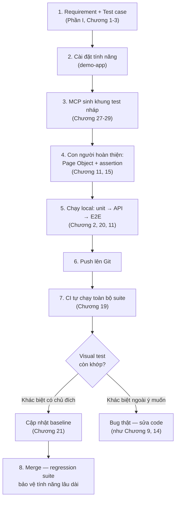

# Chương 30: Case study thực tế — xây pipeline test bán tự động với AI + Playwright

## Mục tiêu học

- Áp dụng lại toàn bộ quy trình đã học — từ khái niệm QA (Phần I) đến AI/MCP (Phần VI) — cho một
  tính năng **hoàn toàn mới**, viết ra ngay trong chương này.
- Thấy rõ visual testing (Chương 21) tự phát hiện một thay đổi UI thật khi tính năng mới được thêm.
- Tổng kết: một pipeline test bán tự động trông như thế nào khi kết hợp đủ các kỹ thuật.

> Code mẫu: `code/playwright-tests/pages/ForgotPasswordPage.ts` +
> `tests/ch30-case-study.spec.ts` (5 test case, CS-01 → CS-05) — tự động hoá đầy đủ một tính
> năng mới ("Quên mật khẩu") vừa được thêm vào `demo-app` cho chính chương này.

## 30.1. Bài toán: thêm tính năng "Quên mật khẩu"

Demo app (từ Chương 9) chưa có tính năng quên mật khẩu. Chương này đóng vai một task thực tế: viết
requirement, test case, tự động hoá, và xác nhận qua CI — đúng chu trình SDLC đã học ở Chương 1,
nhưng lần này áp dụng đủ mọi kỹ thuật đã học trong suốt 29 chương trước.

**Yêu cầu (rút gọn):** Trang `/forgot-password` cho phép nhập email, gửi yêu cầu, luôn hiển thị
một thông báo chung (không tiết lộ email có tồn tại trong hệ thống hay không — đúng nguyên tắc
bảo mật đã học ở TC-03, Chương 1 và 3).

## 30.2. Bước 1: Viết test case trước (shift-left, Chương 1)

| ID | Tiêu đề | Kết quả mong đợi |
|---|---|---|
| CS-01 | Gửi yêu cầu với email hợp lệ | Hiển thị: "Nếu email tồn tại trong hệ thống, hướng dẫn đặt lại mật khẩu đã được gửi." |
| CS-02 | Gửi yêu cầu với email KHÔNG tồn tại | **Cùng** thông báo với CS-01 — không tiết lộ khác biệt |
| CS-03 | Bỏ trống email | Không submit được, lỗi "Email là bắt buộc" |
| CS-04 | Sai định dạng email | Không submit được, lỗi "Email không đúng định dạng" |
| CS-05 | Từ trang đăng nhập, bấm "Quên mật khẩu?" | Chuyển đúng sang `/forgot-password` |

CS-02 là test case **quan trọng nhất** — nó kiểm tra một thuộc tính bảo mật (không rò rỉ thông tin
tài khoản), không chỉ "tính năng hoạt động".

## 30.3. Bước 2: Cài đặt tính năng, dùng MCP sinh khung test nháp (Chương 28-29)

Sau khi thêm route `/forgot-password` vào `demo-app` (xem `src/views.js`, `server.js`), dùng lại
công cụ đã viết ở Chương 29 để có điểm khởi đầu:

```bash
cd code/playwright-mcp-demo
npm run generate -- http://localhost:3000/forgot-password
```

Kết quả (khung nháp, chưa hoàn chỉnh):

```ts
test("khung test tự sinh cho .../forgot-password", async ({ page }) => {
  await page.goto("http://localhost:3000/forgot-password");
  await page.getByRole("textbox", { name: "Email" }).fill("TODO: điền giá trị");
  // await page.getByRole("button", { name: "Gửi hướng dẫn" }).click();
  // TODO: thêm assertion kiểm tra kết quả mong đợi
});
```

## 30.4. Bước 3: Hoàn thiện thành Page Object + test thật (Chương 15, 11)

```ts
// pages/ForgotPasswordPage.ts
export class ForgotPasswordPage {
  constructor(private page: Page) {}
  async goto() { await this.page.goto("/forgot-password"); }
  async requestReset(email: string) {
    await this.page.getByLabel("Email").fill(email);
    await this.page.getByRole("button", { name: "Gửi hướng dẫn" }).click();
  }
  get emailError() { return this.page.locator("#email-error"); }
  get serverSuccess() { return this.page.locator("#server-success"); }
}
```

```ts
// tests/ch30-case-study.spec.ts
test("CS-02: email không tồn tại vẫn nhận CÙNG thông báo", async ({ page }) => {
  const forgotPasswordPage = new ForgotPasswordPage(page);
  await forgotPasswordPage.goto();
  await forgotPasswordPage.requestReset("khong-ton-tai@example.com");

  await expect(forgotPasswordPage.serverSuccess).toHaveText(
    "Nếu email tồn tại trong hệ thống, hướng dẫn đặt lại mật khẩu đã được gửi."
  );
});
```

Chạy `npm test -- ch30-case-study`: **5/5 pass** — cả 5 test case đã được tự động hoá đầy đủ.

## 30.5. Một phát hiện thật: visual test (Chương 21) tự bắt được thay đổi

Sau khi thêm link "Quên mật khẩu?" vào trang đăng nhập (`loginPage()` trong `views.js`) và chạy
lại **toàn bộ** suite, `ch21-visual-testing.spec.ts` **fail**:

```
Expected: tests\ch21-visual-testing.spec.ts-snapshots\login-page-chromium-win32.png
Received: ...\login-page-actual.png
```

**Đây không phải lỗi** — đây là visual testing đang làm đúng việc của nó: phát hiện trang `/login`
đã thay đổi layout (thêm 1 dòng link mới) so với baseline cũ. Vì thay đổi này là **có chủ đích**
(tính năng mới), bước xử lý đúng là cập nhật lại baseline:

```bash
npx playwright test ch21-visual-testing --update-snapshots
```

Sau đó chạy lại toàn bộ suite: **63/63 pass**. Đây là minh chứng thật, xảy ra ngay khi viết chương
này — không phải ví dụ dựng sẵn — cho quy trình thật mà một team sẽ làm mỗi khi visual test báo
"khác biệt": xác nhận thay đổi có chủ đích hay không, rồi mới quyết định cập nhật baseline hay sửa
lại code.

## 30.6. Toàn cảnh: một pipeline test bán tự động



"Bán tự động" (không phải "hoàn toàn tự động") vì con người vẫn giữ vai trò quan trọng ở bước 1
(quyết định test case nào cần), bước 4 (review và hoàn thiện code do MCP/heuristic sinh ra), và
bước 8 (quyết định một khác biệt visual là bug hay thay đổi có chủ đích). AI/MCP hỗ trợ tăng tốc
các bước lặp lại (bước 3), không thay thế phán đoán của con người ở các bước quyết định.

## Bài tập tổng hợp (áp dụng lại từ Chương 1 đến 30)

1. Chạy toàn bộ `npm test` trong `code/playwright-tests/`, xác nhận 63/63 pass.
2. Chọn một tính năng khác bạn muốn thêm vào demo-app (ví dụ: đổi mật khẩu khi đã đăng nhập). Áp
   dụng lại đúng quy trình ở mục 30.2-30.4: viết test case trước, cài đặt, dùng MCP sinh khung
   nháp, hoàn thiện thành Page Object + test thật.
3. Sau khi thêm tính năng ở bài 2, chạy lại toàn bộ suite — nếu `ch21-visual-testing` fail, làm
   theo đúng quy trình ở mục 30.5 để xử lý.
4. Nhìn lại sơ đồ ở mục 30.6 — với dự án thật bạn đang làm (nếu có), vẽ lại sơ đồ tương tự, đánh
   dấu bước nào bạn đã có, bước nào chưa có.

## Tóm tắt toàn sách

- **Phần I-II:** QA không phải một giai đoạn cuối cùng — testing xuyên suốt SDLC, và automation QA
  là sự kết hợp giữa tư duy QA và năng lực kỹ thuật.
- **Phần III-IV:** Playwright cung cấp API vững chắc (locators, actions, assertions, auto-waiting)
  cùng cấu trúc tổ chức test (POM, fixtures, CI/CD) để xây một suite bền vững.
- **Phần V:** Các kỹ thuật nâng cao (API testing, visual testing, storage state, parallel, cross-
  browser, component testing) mở rộng phạm vi và tốc độ của suite đó.
- **Phần VI:** MCP mở ra một trục hoàn toàn khác — AI agent tự điều khiển trình duyệt, hỗ trợ sinh
  test case — bổ trợ, không thay thế, automation test truyền thống.

Xuyên suốt sách, mọi ví dụ đều **chạy được thật**, và ít nhất 2 lần automation test tự phát hiện
bug thật (Chương 9, 14) — đây chính là giá trị cốt lõi mà cuốn sách muốn truyền tải: automation
testing không phải để "có test cho có", mà để phát hiện vấn đề thật, sớm nhất có thể, lặp lại được
mãi mãi.
